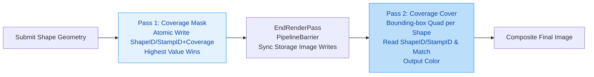

This document provides a comprehensive technical analysis and comparison of the **Coverage-Mask-Then-Cover** technique used in TpvCanvas in PasVulkan for rendering transparent shapes, against other mainstream approaches in the field of 2D graphics rendering. It also explores alternative solutions for handling complex transparency scenarios, delves into specific technical questions, and presents a trade-off analysis to guide implementation decisions.

---

## 🆚 1. Coverage Buffer Technique Comparison

The TpvCanvas method **Coverage-Mask-Then-Cover** is essentially a **Coverage-based Depth Sorting Alternative**. Its core idea is: **The shape with the highest 32-bit stamp+coverage value to "own" a pixel determines that pixel's final color**, thereby avoiding complex depth sorting or depth peeling. Many modern engines use similar ideas, but implementation details vary. In the following text, TpvCanvas's stamp ID is referred to as "Shape ID / Stamp ID" for clarity to those familiar with other engines.

### 1. Technical Implementation Comparison

The table below compares the core mechanisms of TpvCanvas against other mainstream implementation approaches.

| Feature Dimension | TpvCanvas (PasVulkan) | Pathfinder | piet-gpu / vello | NanoVG (Vulkan) | Skia Ganesh (Vulkan) |
| :--- | :--- | :--- | :--- | :--- | :--- |
| **Core Idea** | **Atomic Ops + Highest Stamp+Coverage Wins** | **Geometry Decomposition + Depth Sorting** | **Tile/Warp Parallel + Local Atomics** | **Two-Pass Rendering (Geometry+Composite)** | **Multi-pass Depth Peeling Variant** |
| **Coverage Data** | **32-bit Atomic: ShapeID/StampID(24b) + Coverage(8b)** | **Coverage Buffer** (Count or Depth) | **Tile/Warp Local Buffer** | **Intermediate Color Buffer** | **Depth Buffer + Color Buffer** |
| **Atomic Operations** | **Yes (imageAtomicCompSwap)** | No (Based on Pre-sorting) | **Yes (In Compute Shader)** | No (Based on Pre-sorting or Blending) | **No (Based on Pass Sorting)** |
| **Antialiasing** | **Analytical/SDF** (High Quality) | **Analytical/SDF** | **Analytical/SDF** | **MSAA** (Optional) | **Analytical/MSAA** |
| **Render Passes** | **1 Pass Interrupt + Restart** (For Barrier) | **1 Pass** (Or a few) | **1 Pass** (Compute Shader Main) | **2 Passes** (Geometry + Composite) | **Multiple Passes** (Depth Peeling) |
| **Shape ID Management** | **24-bit, Periodic Buffer Reset at overflows** | Depth Value replaces ID | **Local ID within Tile/Warp** | No Direct ID Management | No Direct ID Management |
| **Dependencies** | `fragmentStoresAndAtomics` | Basic Vulkan | `VK_KHR_shader_subgroup` | Basic Vulkan | Basic Vulkan |
| **Main Advantage** | **Simple Implementation, Single Write** | **Order Independent, High Quality** | **Extreme Parallelism, No Global Atomics** | **Good Compatibility, Traditional Pipeline** | **High Quality, Mature Engine** |
| **Main Challenge** | **Shape ID / Stamp ID Reset Overhead, Intra Render Pass Barriers with Render Pass Restart** | **CPU Sorting Overhead** | **High Complexity, New Hardware Needed** | **Potentially High Fill Rate** | **High Pass Count, Overhead** |

### 2. Detailed Implementation Comparison

#### **TpvCanvas: Coverage-Mask-Then-Cover**


-   **Method**: In the first pass, each fragment attempts to write its shape ID / stamp ID and coverage to a storage image using `imageAtomicCompSwap`. The fragment with the highest UINT32 value (24-bit stamp + 8-bit coverage) to write "wins" for that pixel. In the second pass, a bounding-box quad for each shape reads the coverage buffer, retrieves the shape ID / stamp ID, and outputs the corresponding color with antialiased coverage.
-   **Core of Atomic Operations**: `imageAtomicCompSwap` ensures **O(1)** time complexity to determine the "owner" of each pixel, avoiding O(N) depth sorting. This fits scenarios where many shapes (dense text, complex paths) might overlap a single pixel.
-   **Advantage of SDF-AA**: Calculating **Signed Distance Field (SDF)** in the fragment shader and converting it to coverage (0-255) provides **extremely smooth, high-quality edges** without the overhead of MSAA multi-sampling. This is crucial for text rendering.
-   **Inevitability of Pass Interruption**: As noted, `vkCmdPipelineBarrier` is necessary because **Vulkan specs have strict restrictions on read/write synchronization of storage images inside traditional render passes**. Interrupting the pass and inserting a memory barrier is the **standard and safest way** to ensure all fragment shader writes are visible to subsequent reads. The overhead is usually **lower** than the potential performance loss of using `VK_EXT_fragment_shader_interlock` on some hardware, and compatibility is better.
-   **Shape ID / Stamp ID and Reset**: The 24-bit ID (~16.7 million) is sufficient for most scenes. When approaching the limit, **clearing the entire coverage buffer** is necessary. This overhead can be amortized by **batch processing shapes** (i.e., accumulating a large number of shapes until a reset is needed).
-   **Coverage**: Coverage Image Buffer is a single 32-bit unsigned integer per pixel, leading to a **fixed memory footprint** (e.g., ~4MB for 1080p). This is **extremely memory efficient** compared to A-Buffer or depth peeling methods. The 8-bit coverage from the lower bits of the 32-bit value alongside the 24-bit stamp allows for **256 levels of antialiased coverage**, which is generally sufficient for high-quality rendering.
-   **Advantage**: **Simplicity, Efficiency, and Quality**. The method is easy to implement, has low computational overhead (single atomic write/read), and provides high-quality antialiased results suitable for UI and text rendering.
-   **Challenge**: The main challenges are managing the shape ID / stamp space (requiring periodic resets) and the overhead of render pass interruption due to Vulkan's synchronization requirements of barriers in render passes. However, these can be mitigated through careful batching and design.

#### **Pathfinder: Geometry Decomposition + Depth Sorting**
Pathfinder employs a different Order-Independent Transparency (OIT) strategy. It does not rely on atomic operations but rather **depth-sorts geometry on the CPU or in a compute shader** to render front-to-back.
-   **Method**: Decomposes complex paths into **simple triangles**. By calculating a depth value for each triangle and sorting based on it, triangles closer to the camera are rendered last.
-   **Coverage**: May use a **coverage count buffer** recording how many triangles cover each pixel, but the final pixel color is determined by the **last (front-most) rendered triangle**.
-   **Advantage**: **Avoids atomic operation and storage image synchronization overhead**, potentially more efficient when **depth complexity is extremely high** (e.g., thousands of overlapping layers). Antialiasing quality is also top-tier.
-   **Challenge**: **CPU-side sorting overhead** can become a bottleneck, especially for dynamically changing content. It cannot solve the "owner" problem with a single atomic operation like TpvCanvas.

#### **piet-gpu / vello: Tile/Warp Parallel Computing**
This is the **cutting edge of next-gen 2D renderers**, completely stepping outside the traditional rasterization pipeline.
-   **Method**: Works in **compute shaders**. It divides the rendering area into **small tiles** or utilizes the **GPU Wavefront/Warp** SIMD nature. Each tile/warp processes all fragments in parallel and resolves overlaps and sorting locally (shared memory/registers).
-   **Coverage**: Each tile maintains a local fragment list or uses **local atomic operations** to merge coverage information, finally outputting a single final color.
-   **Advantage**: **Ultimate parallelism**, **no global atomic operations**, **low bandwidth pressure**, highly suitable for modern GPU architectures. Can easily handle **massive overlapping shapes**.
-   **Challenge**: **Extremely high implementation complexity**, requires specific hardware (e.g., subgroup operation support), and has a high barrier to entry.

#### **NanoVG (Vulkan) & Skia Ganesh (Vulkan): Traditional & Mixed**
These mature engines offer more "traditional" but highly compatible solutions.
-   **NanoVG**: Usually employs **two-pass rendering**. The first pass renders all opaque objects. The second pass renders all transparent objects, often requiring **manual sorting or enabling depth testing** (though this affects transparency). Its Vulkan backend might use **Framebuffer Objects (FBOs)** to store intermediate results rather than storage images.
-   **Skia Ganesh**: Its Vulkan backend implements a **variant of Depth Peeling**. It uses **multiple render passes**, "peeling" the front-most transparent layer one by one, then compositing. This requires **multiple Passes**, but ensures correct visual results.
-   **Commonality**: They are more likely to rely on **traditional blend modes** (like premultiplied alpha blending) and **depth testing** (with limitations), and usually require **CPU-side coarse sorting** for complex overlapping scenes, which can be a performance bottleneck. Antialiasing mostly relies on MSAA or analytical methods.

---

## ⚙️ 2. Alternative Technical Solutions Analysis

In addition to coverage buffers, there are other classic and modern solutions for handling complex transparency.

### 1. A-Buffer & Per-Pixel Linked Lists (PPLL)
-   **Principle**: Maintains a **linked list** for each pixel, storing all fragments covering that pixel (color, depth). In the final pass, the list is traversed, sorted by depth, and composited.
-   **Vulkan Implementation**: Usually requires **large amounts of video memory** (storing list heads and nodes) and uses **atomic operations** to manage list insertion.
-   **Comparison to TpvCanvas**: **Highest visual quality**, perfectly handling all overlaps. But **huge memory overhead**, complex implementation, and **list traversal can be a performance bottleneck**. TpvCanvas's solution is a **"Highest-Stamp+Coverage-Wins" simplification** of this, using a single atomic operation to determine the pixel owner (highest 32-bit value wins) for extremely low memory and computational cost.

### 2. Depth Peeling & Variants
-   **Principle**: Uses **multiple render passes**. The first pass renders the nearest depth layer, the second renders the second-nearest (ignoring the first pass fragments), and so on. Finally, all layers are blended in correct order.
-   **Comparison to TpvCanvas**: **High quality**, order-independent. But **Pass count scales linearly with depth complexity**, leading to massive performance overhead. Skia's solution is a simplified version, peeling only a limited number of layers. TpvCanvas's **single-pass atomic operation** is far more efficient.

### 3. Stencil-based Techniques
-   **Principle**: Uses the **Stencil Buffer** to record pixel coverage. Each shape render updates the stencil value, and subsequent shapes decide whether to render based on the stencil value.
-   **Comparison to TpvCanvas**: **Only suitable for limited numbers** of layers (e.g., 2-3 layers). Cannot handle arbitrary overlaps, and **antialiasing is difficult**. TpvCanvas's **coverage buffer** is a more powerful and flexible version.

The following table summarizes the key trade-offs of these solutions.

| Solution | Memory Overhead | Computational Overhead | Implementation Complexity | Visual Quality | Best Scenario |
| :--- | :--- | :--- | :--- | :--- | :--- |
| **Coverage-Mask-Then-Cover** | **Low** (1 Storage Image) | **Low** (1 Atomic Write/Read) | **Medium** | **High** (SDF-AA) | **General High Performance**, **Text/UI** |
| **A-Buffer/PPLL** | **Extremely High** (List Storage) | **High** (List Traversal/Sorting) | **Extremely High** | **Perfect** | **Offline/High-end Rendering with Extreme Quality Demands** |
| **Depth Peeling** | **Medium** (Multiple Depth/Color Buffers) | **Extremely High** (Multiple Passes) | **Medium** | **Perfect** | **Scenes with Controllable High Depth Complexity** |
| **Stencil-based** | **Low** (Stencil Buffer) | **Low** | **Simple** | **Low** (No AA) | **Very Simple 2-3 Layer Transparency** |

---

## 🔍 3. Deep Dive into Technical Questions

### 1. Storage Image & Layout
-   **TpvCanvas**: Uses `VK_IMAGE_LAYOUT_GENERAL`. This is the simplest layout, allowing **read/write and arbitrary access**, but **may not be optimal**. Transitioning to `VK_IMAGE_LAYOUT_SHADER_READ_ONLY_OPTIMAL` (if read-only) in the barrier might offer minor performance gains, but is more complex.
-   **Other Engines**:
    -   **Pathfinder**: Might use **Sampled Images** instead of storage images, since it often only needs to read pre-calculated coverage.
    -   **piet-gpu/vello**: In compute shaders, might use **Storage Buffers** or **Shared Memory** for tile-local data, avoiding image layout issues entirely.

### 2. Shape ID Management and Wrapping
-   **TpvCanvas**: The 24-bit ID is **compact and efficient**. Periodic buffer clearing is **acceptable**, because the clear operation (`vkCmdClearColorImage`) is very fast, and when amortized over many shapes, the overhead is negligible. The key is to **avoid frequent resets**.
-   **Alternatives**:
    -   **Pathfinder**: Uses **depth values** instead of IDs, avoiding ID space exhaustion, but requires depth sorting.
    -   **piet-gpu/vello**: Uses **local, short-lived IDs** within tiles/warps, which never run out.
    -   **A-Buffer**: Each fragment node stores full info; no ID concept.

### 3. Antialiasing Techniques (AA)
| Technique | Principle | Quality | Performance | Difficulty | Applicability |
| :--- | :--- | :--- | :--- | :--- | :--- |
| **SDF-AA** (TpvCanvas, Pathfinder, piet-gpu) | Calculate Signed Distance Field, map to coverage | **⭐⭐⭐⭐⭐** Very High | **⭐⭐⭐⭐⭐** High (Calc once) | **⭐⭐⭐⭐** Medium (Need geometry analysis) | **Top Choice for Vector Graphics**, **Text** |
| **MSAA** (NanoVG, Skia) | Multi-sample, resolve coverage | **⭐⭐⭐⭐** High | **⭐⭐⭐** Medium (High fill rate pressure) | **⭐⭐⭐⭐⭐** Low (Hardware support) | **Traditional 3D Pipeline**, **Good Compatibility** |
| **Analytical AA** (Pathfinder, Skia) | Analyze geometry equations, calculate coverage area | **⭐⭐⭐⭐** High | **⭐⭐⭐⭐⭐** High (Analytical calc) | **⭐⭐⭐⭐⭐** High (Math heavy) | **Simple Geometry**, **High Quality Requirements** |

**TpvCanvas's SDF-AA is a core advantage**. It generates perfect antialiased coverage for a shape in a **single pass**, integrates perfectly with the coverage mask, and is the best balance of performance and quality.

### 4. Render Pass & Barrier Overhead
-   **Overhead of Pass Interruption**: This concern is valid. `vkCmdEndRenderPass` and `vkCmdBeginRenderPass` are **not zero-cost**; they involve resource transitions and state setting inside the driver.
-   **Amortizing Overhead**: The key is **batching**. Do not interrupt the pass for every shape. **Accumulate a batch of shapes** (e.g., all transparent shapes in a frame), then execute the **Mask -> Barrier -> Cover** flow once. This way, the pass interruption overhead is amortized over thousands of shapes, becoming negligible.
-   **Alternative with `VK_EXT_fragment_shader_interlock`**: This extension allows fragment shaders to synchronize on a pixel region, theoretically avoiding pass interruption. However:
    -   **Hardware Support**: Not all GPUs support this, especially mobile GPUs.
    -   **Performance Not Necessarily Better**: Interlocking itself can introduce serialization and stalling; its benefit is highly hardware/workload dependent. For a simple "highest value wins" mode, **global atomic operations (like TpvCanvas) are usually more efficient and simpler** than fine-grained interlocking.
    -   **Complexity**: Using extensions adds code complexity and compatibility testing burden.
    -   **Conclusion**: For the specific algorithm of TpvCanvas, **the current Pass Interruption + Barrier approach is the more pragmatic, efficient, and compatible choice**.

### 5. Blending Modes
-   **TpvCanvas**: Uses **Premultiplied Alpha Blending** (`VK_BLEND_FACTOR_ONE, VK_BLEND_FACTOR_ONE_MINUS_SRC_ALPHA`). This is the **standard best practice** for handling transparency because it guarantees correct blending order (unpremultiplied alpha results vary by order).
-   **Other Engines**: Most also use premultiplied alpha blending. Both Skia and NanoVG use it extensively. A-Buffer and depth peeling also use premultiplied alpha blending in the final compositing stage.

### 6. Clip Regions
-   **TpvCanvas**: Calculates the shape's **bounding box in the vertex shader** and uses **ClipRects** in the fragment shader for **early fragment rejection**, avoiding expensive image loads and coverage calculations for fragments outside the clip region. This is a **crucial performance optimization**.
-   **Other Engines**:
    -   **Pathfinder**: Applies clipping during the geometry decomposition stage.
    -   **piet-gpu/vello**: Considers clipping during tile allocation, only processing tiles within the clip region.
    -   **NanoVG/Skia**: May use **Stencil Tests** or **Scissor Tests** (hardware clipping) for clipping. `Scissor Test` is the most efficient but only handles axis-aligned rectangle clips. For complex clip paths, they might need intermediate buffers or rasterizing the clip shape.

---

## 📊 4. Comprehensive Trade-off Analysis

### 1. Performance Characteristics
| Solution | Fill Rate Pressure | Geometry Complexity Pressure | Memory Bandwidth Pressure | Compute Pressure | **Best Scenario** |
| :--- | :--- | :--- | :--- | :--- | :--- |
| **TpvCanvas** | **Low** (Cover pass is bounding-box quad per shape with ClipRect culling) | **Low** (Geometry only once) | **Medium** (Read/Write coverage image) | **Low** (Simple atomics/SDF calc) | **General 2D UI/Text**, **High FPS** |
| **Pathfinder** | **Low** (Ordered rendering) | **High** (Decompose geometry) | **Low** (Read mostly) | **Medium** (Sorting/Analytical AA) | **Static or Semi-dynamic Content**, **High Visual Quality** |
| **piet-gpu/vello** | **Very Low** (Compute shader parallel) | **Very Low** (Geometry handled in compute) | **Very Low** (Local access) | **High** (Parallel compute) | **Dynamic Content**, **Massive Parallelism**, **New Hardware** |
| **A-Buffer** | **High** (List node writes) | **Medium** | **Extremely High** (List R/W) | **High** (List traversal/sort) | **Offline Rendering**, **Unlimited Overlap** |
| **Depth Peeling** | **Extremely High** (Multiple pass rendering) | **High** (Multiple geometry processing) | **High** (Multiple buffer R/W) | **Extremely High** (Multiple Passes) | **Controllable Depth Complexity**, **High Precision** |

> 💡 **Key Insight**: TpvCanvas's design achieves an **excellent balance between fill rate (Cover Pass) and compute (SDF-AA)**. Its performance bottleneck is typically **memory bandwidth** (reading/writing the coverage image), not compute or fill rate. This is especially friendly for bandwidth-constrained environments like mobile platforms.

### 2. Memory Footprint
| Solution | VRAM Usage | Characteristics |
| :--- | :--- | :--- |
| **TpvCanvas** | **~4MB (1080p)** + Color Buffer | **Very Low**. Just one fixed-size coverage image. |
| **Pathfinder** | **Variable** (Geometry Buffers) | Depends on scene complexity, potentially larger than TpvCanvas. |
| **piet-gpu/vello** | **Variable** (Tile Buffers) | Usually very efficient, but requires temporary compute memory. |
| **A-Buffer** | **Extremely High** (One list per pixel) | **Can be hundreds of MB or even GB**, proportional to depth complexity. |
| **Depth Peeling** | **Medium** (Multiple Depth + Color Buffers) | Depends on layers peeled (e.g., 3 layers = 3x depth + color buffer). |

TpvCanvas's memory footprint is **fixed and predictable**, which is a huge advantage.

### 3. GPU Compatibility & Extension Requirements
| Solution | Vulkan Version/Extensions Required | Hardware Requirements | Compatibility |
| :--- | :--- | :--- | :--- |
| **TpvCanvas** | **Vulkan 1.0** (`fragmentStoresAndAtomics`) | **Most modern GPUs** | **⭐⭐⭐⭐⭐** Very High |
| **Pathfinder** | **Vulkan 1.0** | **Most modern GPUs** | **⭐⭐⭐⭐⭐** Very High |
| **piet-gpu/vello** | **Vulkan 1.1+** (`VK_KHR_shader_subgroup` etc.) | **Newer GPUs** (Support subgroup ops) | **⭐⭐⭐** Medium |
| **A-Buffer** | **Vulkan 1.0** | **GPUs with atomic support** | **⭐⭐⭐⭐** High |
| **Depth Peeling** | **Vulkan 1.0** | **Most modern GPUs** | **⭐⭐⭐⭐⭐** Very High |

**TpvCanvas has very loose hardware requirements**, which is another advantage of it as a practical solution.

### 4. Mobile GPU Considerations
Mobile GPUs (e.g., Mali, Adreno) are typically **Tile-Based Deferred Rendering (TBR)** architectures. They have their own optimization strategies.
-   **TpvCanvas Pass Interruption**: On TBRs, **the cost of pass interruption might be higher than on desktop GPUs** because it may interrupt the tile rendering process. **However, through batch processing, this cost can still be amortized**. The access pattern of the coverage image (random read/write) is also a challenge for TBR's on-chip cache.
-   **piet-gpu/vello Tile Method**: **Inherently fits TBR architecture** perfectly because it organizes data by tiles in compute shaders, maximizing data reuse and on-chip cache efficiency. **Has huge potential on mobile**.
-   **Bandwidth Sensitivity**: Bandwidth is a scarce resource on mobile platforms. TpvCanvas's **fixed memory usage** and **low bandwidth pressure** (compared to A-Buffer) are huge advantages.

---

## 🎨 5. GLSL Code

Here is the GLSL fragment shader code snippet for TpvCanvas's Coverage-Mask-Then-Cover technique, illustrating the core logic for both the mask and cover passes, as well as premultiplied alpha handling.

```glsl
#version 450

// ...

#if defined(COVERAGE_MASK_PASS) || defined(COVERAGE_COVER_PASS)
// Coverage buffer for transparent shape rendering (set = 1, binding = 0)
// Uses R32_UINT format with packed stamp (24 bits) + coverage (8 bits)
layout(set = 1, binding = 0, r32ui) uniform uimage2D uCoverageBuffer;
#endif

// ...

void main() {
  // ...
#ifdef COVERAGE_MASK_PASS
  // Coverage mask pass: write packed stamp+coverage to coverage buffer via atomicMax
  // Packed format: upper 24 bits = shape stamp, lower 8 bits = coverage (alpha * 255)
  uint shapeStamp = pushConstants.data[7].y;
  uint coverage8 = uint((clamp(color.a, 0.0, 1.0) * 255.0) + 0.5);
  uint packed = (shapeStamp << 8) | coverage8;
  ivec2 pixelPosition = ivec2(gl_FragCoord.xy);
  imageAtomicMax(uCoverageBuffer, pixelPosition, packed);
  // No color output in mask pass
  outFragColor = vec4(0.0);
#elif defined(COVERAGE_COVER_PASS)
  // Coverage cover pass: read from coverage buffer and output final color
  // Only output if stamp matches current shape and pixel has coverage
  uint shapeStamp = pushConstants.data[7].y;
  ivec2 pixelPosition = ivec2(gl_FragCoord.xy);
  uint packed = imageLoad(uCoverageBuffer, pixelPosition).r;
  uint storedStamp = packed >> 8;
  uint storedCoverage8 = packed & 0xFFu;
  if ((storedStamp == shapeStamp) && (storedCoverage8 > 0u)) {
    float coverage = float(storedCoverage8) / 255.0;
    // Clear the pixel in coverage buffer after reading (for next shape)
    imageStore(uCoverageBuffer, pixelPosition, uvec4(0u));
    // Check if texture is already premultiplied (bit 1 of flags)
    bool isTexturePremultiplied = (pushConstants.data[7].w & (1u << 1)) != 0u;
    if (isTexturePremultiplied) {
      // Texture already premultiplied: de-premultiply, apply coverage, re-premultiply
      // Avoid division by zero
      vec3 unpremultiplied = (color.w > 1e-4) ? (color.xyz / color.w) : color.xyz;
      outFragColor = vec4(unpremultiplied * coverage, coverage);
    } else {
      // Non-premultiplied texture: apply coverage directly (premultiplies in the process)
      outFragColor = vec4(color.xyz * coverage, coverage);
    }
  } else {
    discard;
  }
#else
  // Pre-multiply RGB by alpha for correct premultiplied alpha blending
  // This prevents overdraw artifacts with transparent overlapping geometry
  // Check if texture is already premultiplied (bit 1 of flags)
  bool isTexturePremultiplied = (pushConstants.data[7].w & (1u << 1)) != 0u;
  if (isTexturePremultiplied) {
    // Texture already premultiplied, output as-is to avoid double-multiplication
    outFragColor = color;
  } else {
    // Non-premultiplied texture, premultiply now
    outFragColor = vec4(color.xyz * color.w, color.w);
  }
#endif
  // ...
}
```

## 🎯 6. Conclusions and Recommendations

1.  **TpvCanvas's Coverage-Mask-Then-Cover is an extremely efficient, practical, and high-quality solution**. By combining **atomic operations + SDF-AA**, it achieves a **near-perfect balance between performance, memory footprint, implementation complexity, and visual quality**. It is particularly suitable for **User Interfaces, text rendering, and 2D games** where high frame rates are required.

2.  **The overhead of Pass Interruption is not unacceptable**. By **batch processing transparent shapes** (e.g., all shapes in a frame), the overhead of `vkCmdEndRenderPass` and `vkCmdPipelineBarrier` is amortized to a negligible level. This is a more robust choice than using complex extensions.

3.  **For next-gen renderers, the compute shader tiling approach of piet-gpu/vello represents the future direction**. It maximizes parallel efficiency, especially for dynamic content and new hardware. But its complexity and hardware requirements are current deployment obstacles.

4.  **Pathfinder's geometry decomposition sorting offers another high-quality OIT path**, avoiding storage image sync, but introducing potential CPU sorting bottlenecks. Suitable for static or semi-static high-quality rendering.

5.  **Traditional methods like A-Buffer and Depth Peeling still have value for handling extreme depth complexity**, but their performance and memory overhead make them unsuitable for general, real-time 2D rendering.

**Recommendations:**
-   **If building a high-performance general-purpose 2D engine** (like a UI framework or 2D game engine part), **TpvCanvas's approach is an excellent starting point**. It is proven, clear to implement, and highly compatible.
-   **If pursuing ultimate mobile efficiency**, **research piet-gpu/vello's approach** to see if one can move some computation (like coverage calc) to compute shaders and tile the data to leverage TBR architecture.
-   **For Antialiasing, firmly stick to SDF-AA**. It is the "silver bullet" for vector graphics antialiasing: high quality, good performance, and perfectly integrated with the coverage scheme.
-   **Optimize ClipRects**. Ensure early clipping tests in the fragment shader to avoid invalid image loads.
-   **Monitor and optimize coverage buffer access patterns**. Ensure shader code accesses images in a coalesced manner to maximize memory bandwidth utilization.

TpvCanvas's design demonstrates deep graphics expertise and a profound understanding of the Vulkan API. It cleverly transforms a complex problem into a simple, efficient, and robust solution, making it one of the exemplary models for modern vector graphics transparency handling.